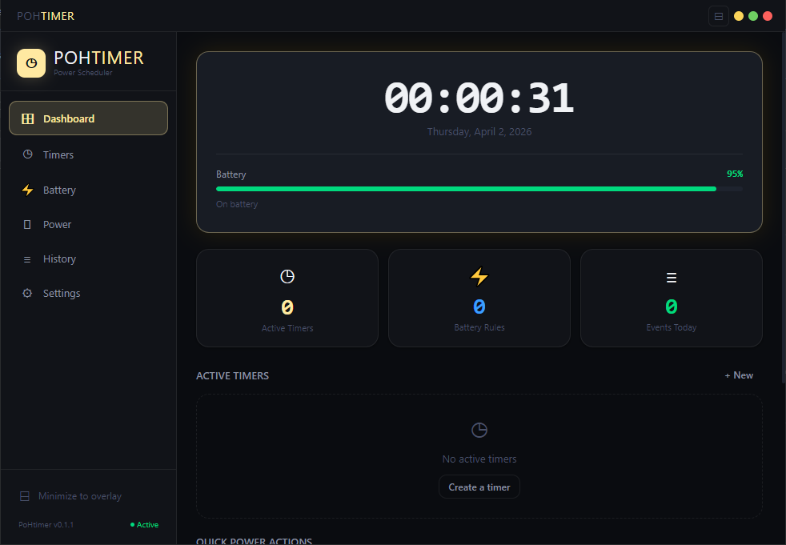

# PoHtimer

<p align="center">
  
  
  
  
  
</p>

<p align="center">
  <b>Professional power management utility for Windows</b><br>
  Schedule shutdowns, monitor battery, and automate power actions with precision.
</p>

<p align="center">
  
</p>

---

## ✨ Features

### ⏱️ Smart Timers
- **Countdown Timers** — Set precise durations with natural language input (e.g., `1h30m`, `90:00`)
- **Scheduled Timers** — Schedule actions at specific times on specific days
- **Recurring Actions** — Automatically repeat timers after completion
- **Smart Scheduling** — Supports daily, weekdays, weekends, or custom day selections

### 🔋 Battery Intelligence
- **Real-time Monitoring** — Live battery level with visual indicators
- **Smart Rules** — Trigger actions on low battery, specific percentages, or AC disconnect
- **Priority System** — Intelligent action ordering (shutdown > restart > hibernate > sleep > lock)

### ⚡ Power Actions
Execute immediate or scheduled power commands:
| Action | Description |
|--------|-------------|
| ⏻ Shutdown | Complete system power off |
| ↺ Restart | System reboot |
| ❄ Hibernate | Save session to disk, power off |
| ☽ Sleep | Low-power standby mode |
| 🔒 Lock | Secure screen lock |
| ⇥ Log Off | Sign out current user |

### 🖥️ Desktop Overlay
- **Minimize to Overlay** — Compact floating clock when minimized
- **Dual Modes** — Digital or analog clock faces
- **Multiple Styles** — Minimal, glass, panel, edge (digital); classic, neon, minimal, halo (analog)
- **Persistent Position** — Remembers overlay position across sessions
- **Timer Integration** — Active countdown visible on overlay

### 🎨 Customization
- **Themes** — Dark, Midnight, and Amber color schemes
- **Accent Colors** — 6 preset colors + custom color picker
- **Notification Control** — Configurable warning lead times
- **Confirmation Dialogs** — Optional 5-second countdown with cancel

---

## 🚀 Installation

### Download
Download the latest installer from the [Releases](https://github.com/Virusilvester/pohtimer/releases) page.

### Build from Source

**Prerequisites:**
- [Node.js](https://nodejs.org/) 18+ and npm
- [Rust](https://rustup.rs/) toolchain
- Windows SDK (for Windows builds)

```bash
# Clone the repository
git clone https://github.com/Virusilvester/pohtimer.git
cd pohtimer

# Install dependencies
npm install

# Run in development mode
npm run tauri dev

# Build production release
npm run tauri build
```

---

## 📖 Usage

### Creating a Timer

1. Navigate to the **Timers** tab
2. Click **+ New Timer**
3. Choose timer type:
   - **Countdown**: Enter duration (e.g., `30m`, `2h`, `1:30:00`)
   - **Schedule**: Set time and select days
4. Select power action
5. Click **Start Timer**

### Battery Rules

1. Go to the **Battery** tab
2. Click **+** to add a rule type:
   - **Low Battery** — Triggers at OS low threshold (~15-20%)
   - **Battery at %** — Custom percentage trigger
   - **Power Disconnected** — AC unplug detection
3. Configure action and enable the rule

### Desktop Overlay

- Click **⊟ Minimize to overlay** in the sidebar, or
- Click the overlay button in the title bar
- **Double-click** overlay to restore
- **Right-click** for context menu
- **Drag** to reposition

### System Tray

- Minimize to system tray for background operation
- Tray shows active timer/rule count
- Click to restore window

---

## ⚙️ Settings

| Setting | Description |
|---------|-------------|
| Start with Windows | Launch on login |
| Start minimized | Open as overlay on startup |
| Ask before closing | Prompt to exit or minimize |
| Notify before action | Warning notification before timer fires |
| Confirm before action | 5-second countdown with cancel option |
| Overlay size | 100px — 300px adjustable |
| Clock style | Digital/Analog with multiple themes |

---

## 🏗️ Architecture

```
PoHtimer/
├── src/                    # Frontend (React + TypeScript)
│   ├── components/         # UI components
│   ├── store.ts           # Zustand state management
│   ├── tauricommands.ts   # Tauri API bridge
│   └── ...
├── src-tauri/             # Backend (Rust)
│   ├── src/
│   │   ├── main.rs        # Application entry
│   │   ├── lib.rs         # Core commands
│   │   └── tray.rs        # System tray implementation
│   └── Cargo.toml
└── package.json
```

**Tech Stack:**
- **Frontend**: React 19, TypeScript, Framer Motion, Zustand
- **Backend**: Rust, Tauri 2.0
- **Styling**: CSS Variables, CSS-in-JS
- **State**: Zustand with persistence

---

## 🔒 Security

- CSP-compliant content security policy
- Local-only operation — no network dependencies for core functionality
- Safe power action execution with confirmation dialogs
- Auto-start requires explicit user consent

---

## 📝 Roadmap

- [ ] macOS and Linux support
- [ ] Remote monitoring API
- [ ] Advanced scheduling (cron expressions)
- [ ] Power usage statistics
- [ ] Dark/Light theme auto-switching
- [ ] Custom sound notifications

---

## 🤝 Contributing

Contributions are welcome! Please feel free to submit a Pull Request.

1. Fork the repository
2. Create your feature branch (`git checkout -b feature/AmazingFeature`)
3. Commit your changes (`git commit -m 'Add some AmazingFeature'`)
4. Push to the branch (`git push origin feature/AmazingFeature`)
5. Open a Pull Request

---

## 📄 License

Distributed under the GPL-3.0 license. See [LICENSE](LICENSE) for more information.

---

## 🙏 Acknowledgments

- [Tauri](https://tauri.app/) — Build smaller, faster, more secure desktop applications
- [React](https://react.dev/) — The library for web and native user interfaces
- [Framer Motion](https://www.framer.com/motion/) — Production-ready motion library

---

<p align="center">
  Made with ⚡ by <a href="https://github.com/Virusilvester">Virusilvester</a>
</p>
